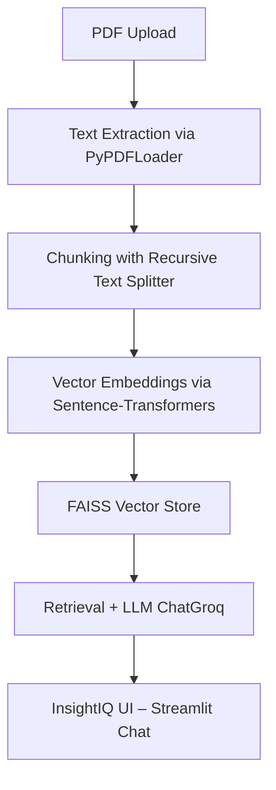

#  InsightIQ – Intelligent Research & Analytics Assistant  

**InsightIQ** is an AI-powered Streamlit app that lets users **chat with research papers, PDFs, and business reports**.  
It combines **document understanding**, **retrieval-augmented generation (RAG)**, and **LLM-based reasoning** to provide  
insightful, context-aware answers — making it a smart **Research Buddy** and **Report Analyst**.

---

## Key Features  

### Research Mode  
- Upload academic papers or technical PDFs.  
- Summarize the paper (short, medium, or detailed).  
- Extract key ideas: problem statement, methods, results, limitations.  
- Chat naturally about the document using context-aware LLMs.  

###  Analyst Mode
- Analyze business and financial reports.  
- Generate executive summaries and KPI insights.  
- Highlight patterns and trends with contextual explanations.  

### Smart Conversational Layer  
- Hybrid intent detection (casual / document / general).  
- Natural responses with contextual memory.  
- Handles small talk while staying focused on the document.  

---

## Tech Stack  

| Component | Technology |
|------------|-------------|
| **Frontend** | Streamlit |
| **Embeddings** | Sentence-Transformers |
| **Vector Store** | FAISS |
| **LLM Interface** | ChatGroq (LLaMA-3.1-8B-Instant) |
| **Document Loader** | PyPDFLoader |
| **Orchestration** | LangChain |
| **UI Styling** | Custom CSS (Responsive & Clean) |

---
##  Architecture Overview



## Setup Instructions  

### 1. Clone this repository  
```bash
git clone https://github.com/<your-username>/InsightIQ.git
cd InsightIQ
```
### 2. **Create a virtual environment**

```bash
python -m venv venv
source venv/bin/activate  # (on macOS/Linux)
venv\Scripts\activate     # (on Windows)
```

### 3. Install dependencies
```bash
pip install -r requirements.txt
```

### 4. Run the app
```bash
streamlit run app.py
```

### Folder Structure
```bash
InsightIQ/
│
├── app.py                 # Main Streamlit application
├── requirements.txt       # Project dependencies
├── README.md              # Project documentation
└── assets/ (optional)     # Icons, sample PDFs, screenshots
```

### UI Highlights
- Modern, responsive layout with tabs for Upload & Analyze and Chat.
- Consistent blue-themed styling across buttons and badges.
- Large, readable typography and intuitive workflow.

### Future Enhancements
-  Analyst Mode (business report understanding).
-  Fine-tuned domain models for research fields.
-  Multi-document comparison.
-  Save & export chat sessions.
  
## Deployed Application

https://insightiq-pro.streamlit.app
